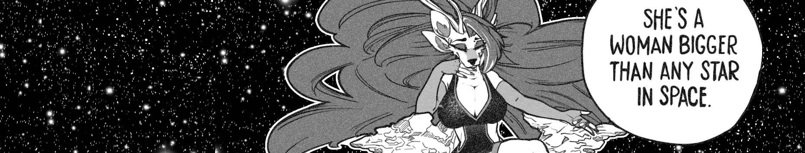

  <picture>
   
  </picture>

# Thea Vanherst

**[She / Her]** Multimedia designer, artist & dev. 
Graduate in information technology / digital media design & art.

I don't tend to use git, and I have tons of other ongoing projects in other media spheres. I'm just here to post my learning experience.

- 💻 I’m currently working as a Digital Media Manager / Designer.
- 🖍 Currently using Vanh.art as a testing landscape for a future work project.
- ✉ Feel free to contact me with Discord; TheaVanherst#1953

## Current Projects:
<picture>
    
</picture>

### 💀 Crypt of the Necrospriter
Designed for Crypt of the Necrodancer to recreate the game-engine look and design to accurately represent sprites as presented in game - open source and written and designed in javascript, designed for the browser for maximum accessability and compatibility with as little as possible backend. 

I also created my own resource pack to test the software during development, which you can view on the [Steam Workshop][1].

<picture>
    
</picture>

### 🦈 Vanh.art
Vanh.art is an experimental blog written in Svelte, Javascript.
The site is focused on developing a unique mean to present all of my current and past projects, alongwith pages to highlight alternate medias such as Art, Design, Modeling and Programming.

Although my website has already been written and uploaded once before and is currently avaliable on github, I'm more than aware it just isn't upto scratch and currently relies on Github to manage my images, which is currently being replaced by Sanity.

It's a learning process, and it'll be a while before I get it upto scratch and comfortable with posting it here.

## Alternate Media Projects:
<picture>
    
</picture>

- Vahn character development Via. character sheet.
- Steam Workshop item sprite clean-up.
- Hardware updates / adjustments.

### 📞 Other "Github" Projects
- Designed and drew the character in my profile picture.
- Commissioned to draw @kiosion OC and current profile picture.

[1]: https://steamcommunity.com/sharedfiles/filedetails/?id=2893560157
